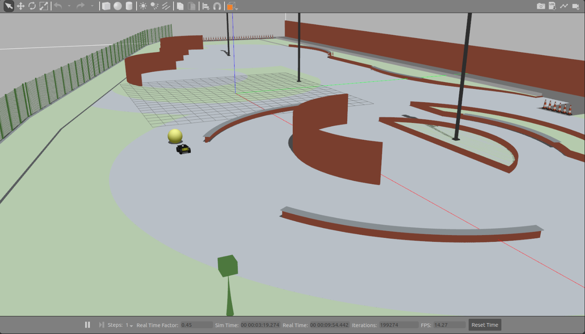

# ROS Search Yellow Ball 🤖  

## Requirements :heavy_check_mark:

- [Linux](https://ryanstutorials.net/linuxtutorial/) 18.04 LTS
- [ROS-Melodic](http://wiki.ros.org/melodic)
- [Gazebo](http://gazebosim.org/tutorials?tut=install_ubuntu&ver=5.0)

## Quick Start 🏁
- `git clone https://github.com/aqvale/ros_search_obj.git` 
- Execute `catkin_make`
- Run `roslaunch cimatec_simulation gazebo.launch`

## Example ##
- Put a yellow ball on the stage and wait the robot to look for the ball.

## Documentation :closed_book:	
- **Used Packages**
  - [Nav2d](http://wiki.ros.org/nav2d)
  - [Velodyne-simulator](https://bitbucket.org/DataspeedInc/velodyne_simulator/src/master/)
  - [Husky](https://github.com/husky/husky)
  - [Navigation](http://wiki.ros.org/navigation#Tutorials)

## Community :earth_americas:
- [Forum](https://discourse.ros.org/)
- [Answers](https://answers.ros.org/questions/)

## Thanks
Thanks you [Senai-Cimatec](http://www.senaicimatec.com.br/) that allowed me to perform this test which provided knowing and learning how to use robotic automation tools. I would like to improve and learn a lot more in this area of study.